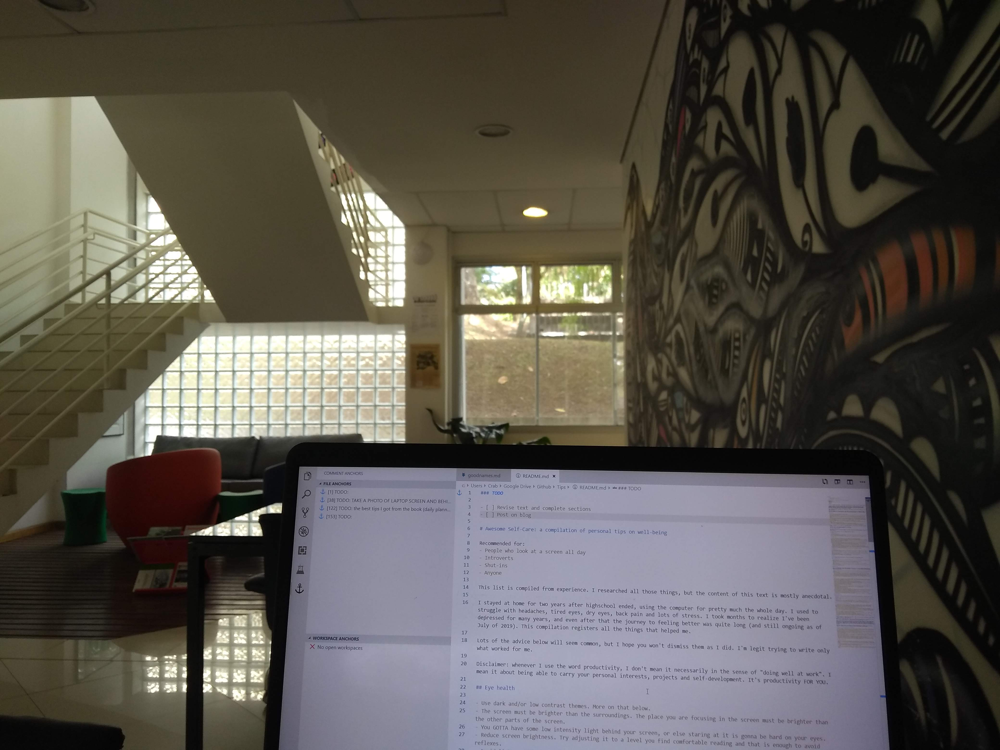

### TODO

- [ ] Revise text and complete sections
- [ ] Post on blog

<h1>Awesome Self-Care: a compilation of personal tips on well-being</h1>

Recommended for:
- People who look at a screen all day
- Introverts
- Shut-ins
- Anyone

This list is compiled from experience. I researched all those things, but the content of this text is mostly anecdotal.

I stayed at home for two years after highschool ended, using the computer for pretty much the whole day. I used to struggle with headaches, tired eyes, dry eyes, back pain and lots of stress. I took months to realize I've been depressed for many years, and even after that the journey to feeling better was quite long (and still ongoing as of July of 2019). This compilation registers all the things that helped me.

Lots of the advice below will seem common, but I hope you won't dismiss them as I did. I'm legit trying to write only what worked for me.

Disclaimer: whenever I use the word productivity, I don't mean it necessarily in the sense of "doing well at work". I mean it about being able to carry your personal interests, projects and self-development. It's productivity FOR YOU.

<h2>Contents</h2>

- [Eye health](#Eye-health)
  - [Themes, extensions and apps](#Themes-extensions-and-apps)
- [Posture](#Posture)
  - [On computer/sitting](#On-computersitting)
  - [When standing](#When-standing)
- [Sleep](#Sleep)
  - [Blue light filters](#Blue-light-filters)
- [Mental health and other stress management tips](#Mental-health-and-other-stress-management-tips)
- [Exercise, nutrition, hygiene and other body matters](#Exercise-nutrition-hygiene-and-other-body-matters)
- [(Personal) productivity](#Personal-productivity)

## Eye health

- Use dark and/or low contrast themes. More on that below.
- The screen must be brighter than the surroundings. The place you are focusing in the screen must be brighter than the other parts of the screen.
- You GOTTA have some low intensity light behind your screen, or else staring at it is gonna be hard on your eyes.
- Reduce screen brightness. Try adjusting it to a level you find comfortable reading and that is enough to avoid reflexes.
- Avoid light reflexes on your screen. For that, stay somewhere where there's little light coming from behind you.
- If you are doing the above and your eyes are still getting fatigued or tired, consider going to an ophthalmologist. A 0.25 difference in my glasses prescription made a lot of discomfort disappear. Also, it was there that I found out I had dry eye problems.
- Use Full HD (1080p) displays if you can. Regular HD (720p) might make letters difficult to read.
- Stare at something far away once in a while. They recommend once every 20 minutes, but honestly I'm not organized enough for that.
- Change zoom until you can read comfortably.
- Palming: rub your hands until warm, seal your eyes with them until hot. Therapeutic
- If your eyes burn (especially after you wake up), try closing them and washing your eyelids with baby soap or facial soap. I do that twice a day from ophthalmologist's recommendation, since I have meibomitis and blepharitis.

Personal recommendation: having low light windows behind your screen it helps a lot. Aside from the low light, you have a far away place to stare. And your eyes will go there without you even thinking. I'll post an example of what I mean, but the quality of the photo isn't very good.

### Themes, extensions and apps

Dark theme for the night or low light environments. Light themes are good in well lighted environments, and some are good in the eyes.

The sleep section has some [Blue Light Filters](#Blue-light-filters) apps.

For computer, I use:

- Terminals: Monokai/Molokai.
- Text editors: One Dark, [Solarized Light](https://ethanschoonover.com/solarized/) (light theme with low contrast, good when you have light shining on your screen).
- I also recommend having a dark wallpaper to avoid having your eyes bleached when going to your desktop or phone home screen.

For firefox, I use:

- Extension: [Dark Background and Light Text](https://addons.mozilla.org/en-US/firefox/addon/dark-background-light-text/). It makes all sites dark or invert the colors, depending on settings. I put the default mode as invert, since it costs less on performance. You can (and will) disable it for specific sites, just click the extension icon while on the site and select "Disabled".
- Extension: [ZenFox](https://addons.mozilla.org/en-US/firefox/addon/zen-fox/). Let's you alternate between Solarized Dark and Solarized Light toolbars.
- Extension: [Stylus](https://addons.mozilla.org/en-US/firefox/addon/styl-us/). It lets you install themes for specific sites. Search them on [UserStyles](https://userstyles.org/) or go to the page, click the add-on icon and click on Find Styles. Then check some of the top ones out until you find one you like.
  - [Global Solarized Light](https://userstyles.org/styles/173443/global-solarized-light) and [Global Solarized Dark](https://userstyles.org/styles/173656/global-solarized-dark) styles. My own styles for making all pages Solarized.
  - My stylus configuration is available on the files above. Just download it and import it through the app.
- [ShadowFox](https://github.com/overdodactyl/ShadowFox): mods firefox to have everything dark. Very important if you are using dark themes, since it avoids the white flashes that occur during page change. It also customizes the add-ons, bookmarks and etc to be dark instead of white.
- I alternate between extensions and styles based on my needs (dark or illuminated environment).

For android, I use:

- App: [Moon+ Reader](https://play.google.com/store/apps/details?id=com.flyersoft.moonreader). An ebook reader with dark mode and brightness control.
- App: [VLC](https://play.google.com/store/apps/details?id=org.videolan.vlc&hl=en). Video player with brightness control.
- App: [Retro Music Player](https://play.google.com/store/apps/details?id=code.name.monkey.retromusic&hl=en). Music player with a dark theme.
- App (unofficial): [YouTube Vanced](https://forum.xda-developers.com/android/apps-games/app-youtube-vanced-edition-t3758757). YouTube with dark theme.

## Posture

I also recommend looking up posture posture for desk work and posture for using phone when sitting.

### On computer/sitting

- Your eye level when in erect posture should match around the top of the screen. Lift the screen with books or other things if necessary.
- Laptops are the devil and make you hunch. If you can, lift the laptop and use a keyboard.
- Lower back support is almost a must if you are sitting for long periods of time.
- Erect back.
- Don't cross your legs, with this time this will twist your spine to one side and create a muscle imbalance.
- Feet on the ground.
- Shoulders and neck should be relaxed and not hunching forward. If you have trouble not hunching forward, search for exercises to correct that.
- If you can, arrange a standing desk.

### When standing

This is a too lengthy topic for me to explain completely, you gotta see it for yourself and keep trying and doing the exercises to correct posture. Search it in proper detail, it's very worth it. I'll only mention a few things that made the whole difference for me:

- Don't carry weight on only one side. This seriously fucks you up. If you end up having to, alternate between sides frequently.
- Reduce how much weight you carry on your backpack. Tip: a bunch of small things and papers quickly add up to considerable weight.
  - If you go to school/uni, one of my best takes is: paper notebooks are heavy. Instead of them, carry a few paper sheets inside folders (the lighter the better). Then number the pages as you go writing. You can have a folder for each subject, and grab only the ones you need for the day. Leave the old contents at home after exams.
- Arcane knowledge: if you wanna look more fit/thin, half of it is posture. Even if you have low body fat, your belly will protrude if you are not erect and using your abs to sustain your weight. This isn't cheating, this is literally what pretty much anyone fit is doing, whether they know it or not.

## Sleep

- Keeping a regular sleep schedule was one of the best changes I made. Improved my mood and energy absurdly, made me much more productive, and made a lot of other habits possible (such as eating properly and exercising). Bad sleep patterns kill your mood without you even noticing.
- A regular sleep schedule is basically: be on bed and wake up around the same time.
- When you go to sleep and when you wake up depends on person. I've noticed that I feel the drowsiest around 9pm. And ifi don't use that opportunity to sleep, I have difficulty sleeping until way after 11pm.
- How much you need to sleep depends on age and person (young people usually need more than 8h of sleep). Personally, I feel more comfortable with around 9h of sleep per day.
- Sleeping too much made me drowsy and with low energy.
- Avoid sugar and high caloric food a few hours before sleep. Personally, they make me feel like shit, aside from being energizing.
- Feed yourself enough to not wake up hungry through the night. I like eating banana + oatmeal, and a sandwich with something filling (sugarless peanut butter, hummus). You can search for food recommendations.
- Drink a glass of water or so before sleep.
- Avoid coffee many hours before sleep.
- Avoid mentally exerting yourself 3~4h before sleep.
- If your schedule derails, wake up at the regular time, go through the day sleepy, and sleep a few hours earlier to compensate the deficit. It's better than deregulating the whole thing for days. If you wake up later to compensate, you'll only be able to fall asleep later on that day, and this will
- Proper sleep posture: sleep on your back or on your side, never on your belly. You can use body pillows if it's uncomfortable for you, search it up. Personally, I sleep sideways and use a long body pillow between my legs.
- If you can't fall asleep, do something relaxing for a few hours.
- If you wake up during the night and can't fall asleep, wake up, drink water, go do something for a few minutes, then get back to bed.

### Blue light filters

Cutting blue light a few hours before sleep help falling asleep faster and sleeping better. Some apps do that for you:

- **Windows**: [F.lux](https://justgetflux.com/). Personally, I make the colors less warm than the default. Too warm causes me eye strain.
- **Linux**: [RedShift](https://github.com/jonls/redshift/). Usually available on command line install (via apt-get, yay, etc)
- **Android and iOS**: well, you'll have to research these (PS: not all of them work). I use the motorola in-built thing, and Night Owl to reduce brightness when needed. If you can, just avoid using phone before bed.
- **IRL:** you can get glasses that filter blue light, there are probably DIY versions as well. Don't have any brand to recommend. Not worth it IMO unless really cheap/DIY, since you can just install the apps on your devices.

## Mental health and other stress management tips

- I recommend reading therapy books even for people who don't feel depressed. They have lots of tips and techniques that you can take for life. My recommendation is [Feeling Good: The New Mood Therapy, by David D. Burns](https://www.goodreads.com/book/show/46674.Feeling_Good). Jump the introduction, read the first chapter and the part about mental distortions, then go straight to the chapter you think will help you the most.
- TODO the best tips I got from the book (daily planner, double column)
- If you have friends where you are, meet them often and hug them af. Socializing and human touch are absurdly important. And I say that as someone who is quite introverted, has little interest in most people, and spent more than 2 years alone. Stress of being alone quickly builds up, but you don't notice this is the cause. With some time you get used to it and things seem normal. But at some point it gets back to you, and it's excruciating (it took 1,5 years for me).
- Overall, don't spend the whole day at the same activities. Variation keeps you sane.
- Don't use the computer for the whole day. I've found out cutting how much time I spend at it significantly reduces stress, even if I spend the remaining time at the smartphone.
- Going outside and seeing new places makes you feel much better, even if you think that you won't. And I'm saying that as someone who hates doing that and doesn't see the point of sightseeing.
- I've found that lying down clears my stress considerably. Use the phone in the meantime if you are bored.
- Napping helps considerably if you are feeling like shit. But restrict them to 30 minutes or less, or else you'll feel groggy.

If you feel constantly or regularly down, uninterested, stressed, anxious and/or have low self-esteem, consider seeing a therapist. A psychiatrist might help as well.

Medication isn't as bad as people make it to be. It won't make you lose your sense of self. If you have lots of side effects, you may ask your psychiatrist to change medication, and this one might cause less effects. 

Caution: you don't need to agree with the psychiatrist. Do take the medication and give it the right time(some need around a month to start working, some need time for the side effects to reduce). And then, if it doesn't work for you or present lots of side effects, ask for a change. Based on reports I saw online (in special about the US medical system), be wary of diagnosis that don't seem to fit (especially for ADHD), and for psychiatrists that keep increasing your dose when your medication doesn't work. That said, I don't have the last word in the topic, and I also don't live on the US.

If you can't afford a therapist, the therapy book I mentioned above might help af. Reading a book like that and applying the techniques was proved to increase well-being in a similar manner to actual therapy.

## Exercise, nutrition, hygiene and other body matters

- Exercise is the most cliche advice ever, but it keeps you sane. Exercising releases endorphins, which make you feel good. It's sometimes funny how I'm feeling like shit, and then I do planks on the middle of the room and feel good. Also, how after walking a lot, the same activities feel much better.
- Any kind of exercise will do it. I've found out that just walking to uni and then back to home improves my mental health absurdly. Our goal is to keep you sane, do whatever kind of exercise works well with you. I personally prefer strength and body weight exercises over aerobic exercises such as running.
- There are some body-weight exercises you can do easily anywhere, such as squats, planks, push-ups. There are lots of quick routines on YouTube.
- Put yourself in a position where it's easier do actually do the exercise. Trying to commit to the ideal of "intense exercise 3 times a week" is difficult. Instead, make it so for example you have to walk to the store in order to buy breakfast on some days of the week.
- Don't forget to eat and drink water. Drink enough water to make your urine have a light yellow tone, but not so much that it becomes transparent. Be the most hydrated person around. Set reminders if necessary.
- Avoid sugar in the productive parts of the day. After sometime, your sugar levels drop and you feel like shit.
- If you tend to masturbate, do it before sleep. It helps you fall asleep, and you avoid the fatigue that comes afterwards. Doing it during the day kills your interest, energy and productivity.

## (Personal) productivity

- Pomodoro timers make you much more productive and avoid burnout. Even more useful if you are struggling to be productive for even 2 hours. It also helps with a lot of other habits, such as looking somewhere far away, staying hydrated, etc. You can find one for free at [TomatoTimer](https://tomato-timer.com/), and there's a bunch of software and apps.
- Sticking to goals and guidelines solely out of willpower is difficult. The general strategy is to make it really easy, inviting and maybe even necessary to do what you wanna do. For example:
  - If you wanna learn drawing, leave paper and pencil above your desk.
  - TODO
- Get up once in a while. Maybe stretch and exercise. A good way to keep the habit is keeping little water and no food around, so you have to get up in order to go get it. Examples of quick exercises you can do are planks, squats and pushups.